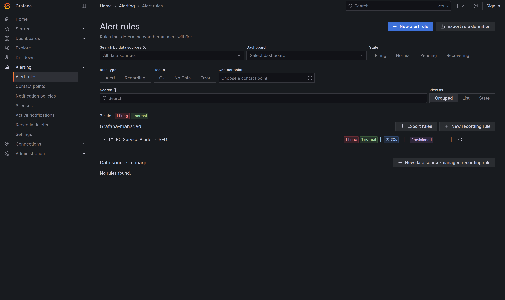
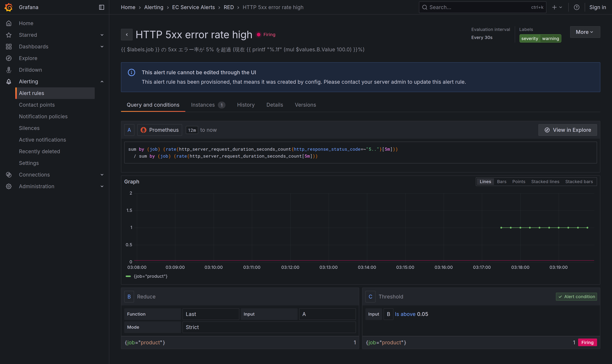
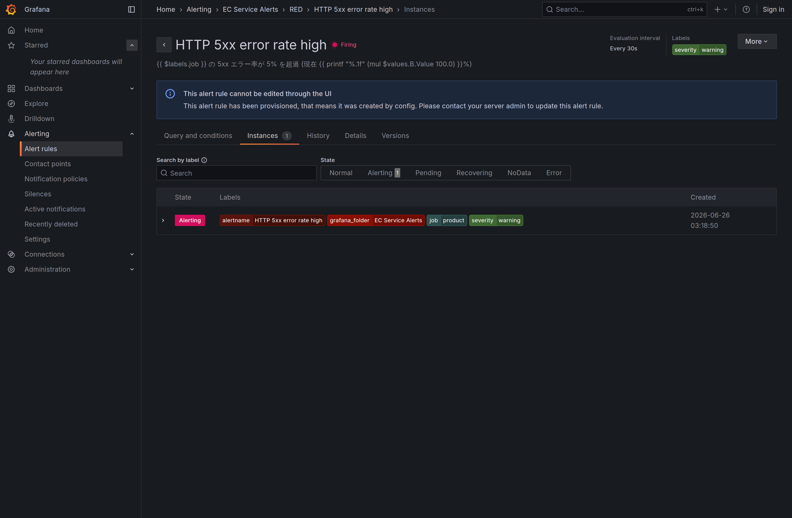
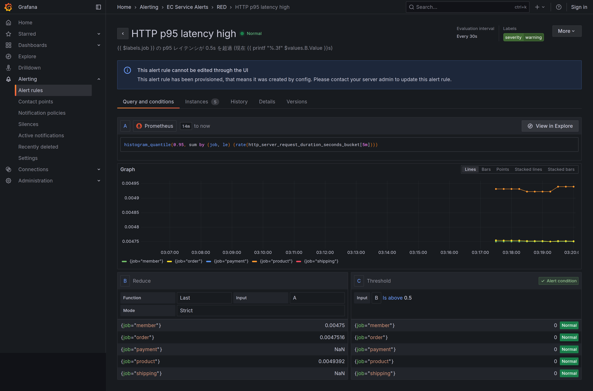

# Step 4-7: RED アラート (Grafana-managed) の動作確認

`infra/o11y/alerting/red-alerts.yaml` で provisioning した Grafana-managed alert を、実スタック
(`docker compose --profile observability up -d`) で発火させたときの記録。方式の判断は
[ADR-202606261100](../../adr/202606261100-alerts-grafana-managed-provisioned.md)。

発火手順 (推測するな、計測せよ): `db-product` を停止して product の `GET /products` を 5xx 化し、
トラフィックを流して 5xx 率を 100% に上げた。閾値・メトリクス名 (`http_server_request_duration_seconds_*`、
サービス識別は `job`、ステータスは `http_response_status_code`) は Prometheus OTLP 変換後の実体を計測して確定。

## アラート一覧 (provisioned)

`EC Service Alerts > RED` フォルダに 2 ルール。`Provisioned` バッジ付きで、1 firing / 1 normal。

## エラー率アラート (firing)

`HTTP 5xx error rate high`。`job="product"` の 5xx 率が 1.0 (=100%) で閾値 0.05 を超過し firing。
クエリ・Reduce・Threshold と評価結果が確認できる。

## firing インスタンス

`job=product` / `severity=warning` ラベル付きで Alerting 状態。

## レイテンシアラート (normal)

`HTTP p95 latency high`。p95 が閾値 0.5s 未満のため Normal。

